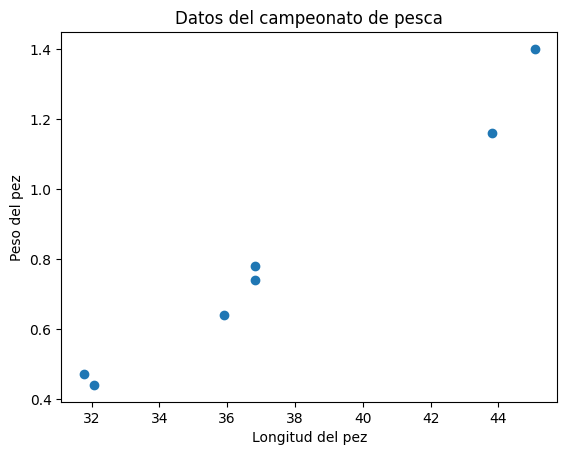
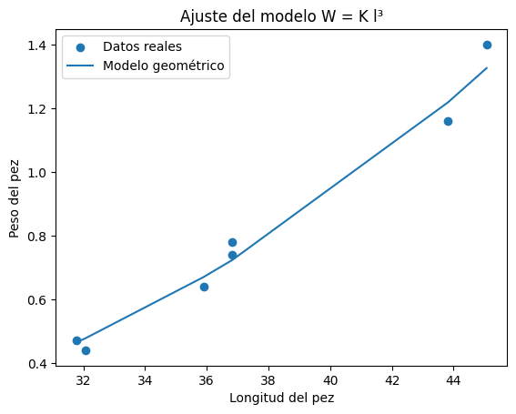
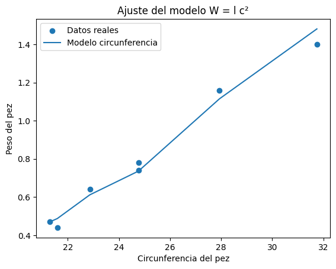
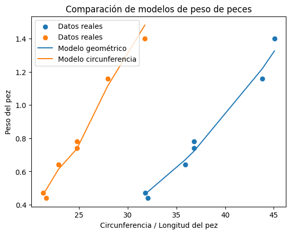

# Práctica 5: Modelos De Similitud Geométrica

## Introducción: 
En el campeonato de pesca de róbalo, el ganador se determina por el peso del pez capturado. Sin embargo, en muchas situaciones medir el peso directamente puede no ser posible o práctico, por lo que resulta útil contar con modelos matemáticos que permitan estimar el peso a partir de dimensiones fáciles de medir, como la longitud o la circunferencia del pez.

Para construir estos modelos se parte de algunos supuestos simplificadores:
1. Todos los peces pertenecen a la misma especie (róbalo).
2. La densidad del pez es constante.
3. Factores como edad, sexo o estación del año no afectan significativamente el peso.
4. Los peces presentan similitud geométrica, es decir, su forma se mantiene aproximadamente proporcional a medida que crecen.
Bajo estos supuestos, el peso de un pez puede relacionarse con su volumen mediante la densidad:

$ W= \rho V$

donde: $W$ es el pedo del pez,  $V$ volumen y $\rho$ la densidad, pero si suponemos que la densidad es constante 

$W \propto V \Rightarrow  W \propto l^3$
Tenmos la siguiente tabla de datos:

| Longitud (cm) | Peso (kg) | Circunferencia (cm) |
| -------------- | --------------- | --------------- |
| 36.81 | 0.78 | 24.77 |
| 31.77 | 0.47 | 21.29 |
| 43.82 | 1.16 | 27.94 |
| 36.82 | 0.74 | 24.77 |
| 32.07 | 0.44 | 21.59 |
| 45.07 | 1.40 | 31.75 |
| 35.89 | 0.64 | 22.86 |
Entonces, tenemos los siguienets modelos: 
# Modelo de similitud geométrica 
Si los peces crecen manteniendo proporciones similares, entonces todas sus dimensiones escalan con la **longitud característica**  $l$ Como el volumen de un cuerpo tridimensional escala con el cubo de su longitud, se obtiene el modelo:

$W=Kl^3$

donde $K$ constante de proporcionalidad que depende de la densidad y la forma del pez.

Este modelo predice que peces más largos deberían pesar aproximadamente proporcional al cubo de su longitud.

# Modelo basado en la circunferencia

El modelo anterior ignora un aspecto importante: dos peces con la misma longitud pueden tener diferentes grosores. Para capturar esta variación se propone un segundo modelo.

Se considera que el volumen del pez es proporcional a la longitud efectiva y al área promedio de su sección transversal: $V \propto l_e A_{prom}$ ahora suponemos que $l_e \propto l$ y que $A_{prom} \propto A_{max}$. Si la sección transversal es un círculo, se pude expresar en términos de la circunferencia como $A_{max} \propto C^2$, por lo que 

$V \propto lC^2$ 

eso nos da el moelo: 

$W=Kl C^2$

Cocn $C=$ circunferencia máxima del pez, $l$ longitud del pez y $K$ constante de proporcionalidad. Este modelo incorpora información sobre qué tan "gordo" es el pez, lo cual puede mejorar la estimación del peso
## Integrantes

1. Domínguez León José Miguel
2. Góngora Ramírez Arturo 
3. Sánchez Ramírez Diego Alberto

## Uso e instalación

Para ejecutar este código correctamente, primero necesitas asegurarte de tener instaladas las librerías de Python: numpy, pandas, matplolib.

La práctica está estructurada en tres archivos distintos para mantener un orden, los cuales son:

- data.py: Se encarga exclusivamente de la lectura y el procesamiento inicial de tu dataset (por ejemplo, cargar la información del archivo CSV y convertirla en estructuras manejables).

- models.py: Aquí viven las definiciones de los modelos predictivos (el geométrico y el basado en circunferencia), así como las herramientas para calcular el error y el coeficiente de correlación.

- main.py: Aquí se definen las funciones para generar las gráficas (plots), se estructura la solución de los ejercicios paso a paso y se importan las herramientas necesarias de los otros dos archivos.

El órden de ejecución es: data, models, main.

## Ejercicio 1

Aunque este ejercicio no tiene una pregunta textual explícita, hacemos una cotejo del comportamiento de los datos con ayuda del coeficiente de Pearson:

La función main() utiliza la función pearson(l, w) para calcular el Coeficiente de Correlación de Pearson entre la longitud y el peso, y pearson(l, c) para la longitud y la circunferencia.

 

Los resultados de estas correlaciones son valores positivos cercanos a 1, lo cual indica una correlación lineal directa. Lo cual se intuye con la disposición de los datos en la gráfica. Además esto justifica estadísticamente la idea del campeonato: es posible predecir el peso usando dimensiones fáciles de medir con una cinta métrica.

## Ejercicio 2

En este ejercicio, se calcula la constante $K$ promediando la relación $W / l^{3}$ y genera predicciones usando la función modelo_geom.

### ¿Qué tan bueno es el ajuste?
El ajuste visualizado mediante la función plot_geom es razonable como primera aproximación, ya que la curva cúbica seguirá la tendencia de crecimiento de los datos reales. El código calcula el Error Cuadrático Medio (error_geom) para juzgar este ajuste, este error es casi cero. 

### ¿Hay algún efecto que nuestro modelo no capture?
Sí. El principal problema de este modelo es que asume una similitud geométrica perfecta basándose únicamente en la longitud. Tal como señala la práctica, al aplicar este modelo se premia a los peces grandes (largos) pero ignora que existen peces "gordos". En este modelo, un pez robusto terminará teniendo el mismo peso estimado que un pez flaco si ambos miden exactamente lo mismo de largo.

## Ejercicio 3

Aquí el modelo evoluciona para tomar en cuenta la sección transversal geométrica del pez utilizando su circunferencia máxima.
### ¿Cómo queda la fórmula explícita del modelo?
La fórmula matemática explícita que se está programando es: $W = K\\ l\\ C_{max}^2$ (Donde $W$ es el peso, $K$ es la nueva constante de proporcionalidad, $l$ es la longitud y $C_{max}$ es la circunferencia máxima).

### ¿Qué tan bueno es el ajuste?
El ajuste es significativamente mejor que el del Ejercicio 2. Al final de la función main(), el código evalúa calc_error para ambos modelos y los compara. Al incluir la variable de la circunferencia máxima, el modelo ahora tiene información sobre el área transversal (qué tan ancho o "gordo" es el pez), lo que compensa la deficiencia del primer modelo. Al ejecutar el script, la evaluación lógica confirmará que el error del modelo de la circunferencia (error_circ) es menor, concluyendo que describe mejor los datos.

## Conclusión
En resumen, el desarrollo de estos ejercicios demuestra que predecir el peso de un róbalo basándose únicamente en su longitud proporciona una estimación inicial razonable bajo el supuesto de que todos los peces son geométricamente similares. Sin embargo, este primer enfoque resulta limitado en la práctica porque premia exclusivamente a los peces largos e ignora por completo que existen peces más robustos o gordos. Al evolucionar el análisis hacia el segundo modelo, se toma como dimensión característica la circunferencia del pez. Utilizando la circunferencia máxima para representar el punto donde el espécimen es más ancho, el modelo logra capturar la variabilidad en la complexión individual.

Al trazar de manera simultánea las predicciones de ambos ajustes sobre la dispersión de los datos reales, se hace evidente cómo la línea del modelo de circunferencia sigue con más precisión la tendencia real de los pesos. Así, concluimos que integrar el "grosor" transversal del pez compensa las deficiencias del modelo geométrico simple, resultando en un método de predicción mucho más justo y exacto para el campeonato.
